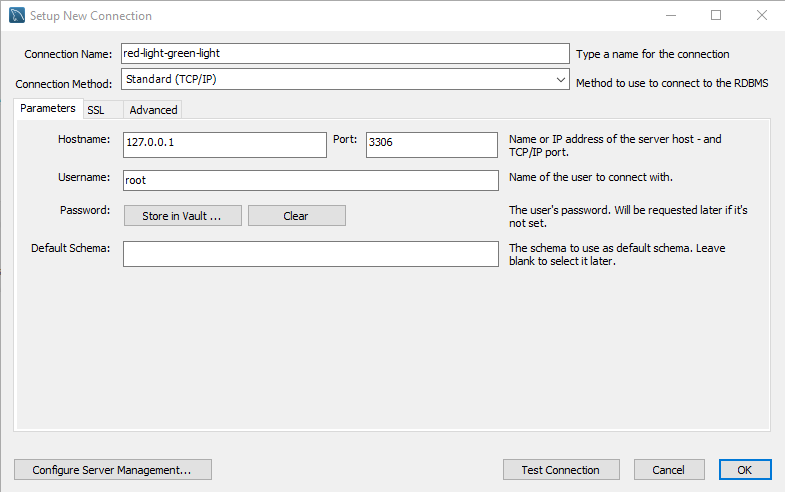

# red-green-light

## Starting your MySQL server
For Red Light Green Light we decided to use MySQL. To set it up locally we tried to make it as easy as possible, so if you haven't already, use the following steps to get MySQL up and running. (But if you already have, refer to [Setting up the database](#setting-up-the-database))

### Intsalling MySQL Workbench
MySQL workbench comes with all the features we need to set up our databases.

Please download MySQL from the following link: https://dev.mysql.com/downloads/workbench/

Be sure that you're downloading **version 8**!

### Already have it installed, but forgot your password?
We all forget our root password sometimes (I know I did), so here's a tutorial just for you: https://dev.mysql.com/doc/refman/8.0/en/resetting-permissions.html

### Setting up the database
Now that we have MySQL primed and ready, create a new database connection. You can leave the options as they are:



Test the connection to make sure it works (using the password for your root account) and click OK

---

## Initializing the DB

Ensure you have a `.env` file in your root folder `red-green-light/.env` with the following structure:

```
JWT={YOUR_JWT_KEY}
DB_USER={YOUR_DB_USER}
DB_PASSWORD={YOUR_DB_PASSWORD}
DB_PORT=3306
DB_HOST=127.0.0.1
DB_AUTH=authdatabase
DB_GAME=gamedatabase

SESSION_SECRET={YOUR_SESSION_SECRET}

AUTH_PORT=4000
GAME_PORT=3000

AUTH_URL=http://localhost:4000
```

If you setup your MySQL server (or the respective apps) on a different port, please ensure you change the information appropriately.

To intitialize the database, navigate to `red-green-light/database` and run `npm start`. This will create all the necessary tables and databases.

---

## Starting the server

Now all that's left to do is run the server. Make sure you're in the root folder `red-green-light` and run the bash script: `run.sh`. If you don't, please run the following commands in separate terminals:

```bash
cd auth/ && npm i && npm start
```

```bash
cd resource/ && npm i && npm start
```